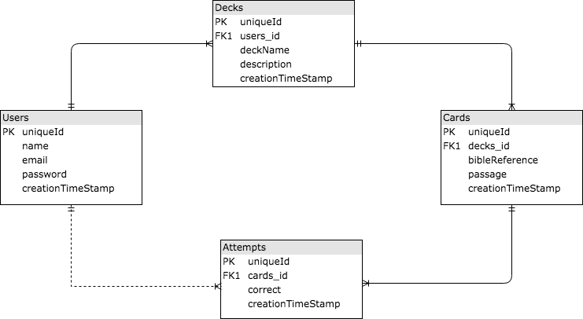

# Flip - Backend Repo
https://bk-flip-app.herokuapp.com/

An interactive flashcard web application to help users memorize information.  Users can create decks to organize groups of cards by topic or any grouping you want.  You can take a quiz on different decks and get the results for the latest quiz session.  The user's total score is stored in the database and displayed next to their name in the header on the dashboard page.

### Entity Relationship Diagram (ERD)



### Setup Instructions
1. Install the node packages: ```npm install ```
2. Create the database: ```createdb bible_mem_dev```
3. Migrate the tables: ```npm run knex migrate:latest```
4. Run the seeds: ```npm run knex seed:run```
5. Run the server in Development Mode ```npm run dev```
